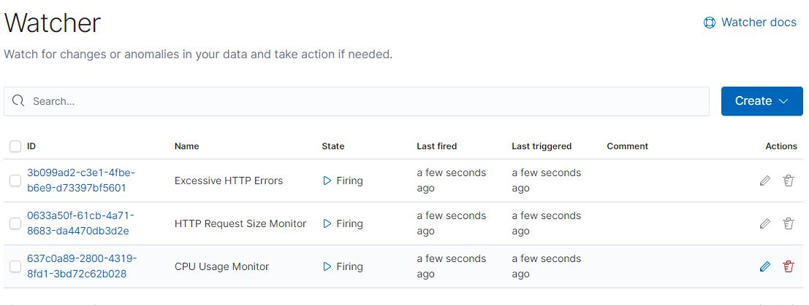

# Blue Team: Summary of Operations

## Table of Contents
- Network Topology
- Description of Targets
- Monitoring the Targets
- Patterns of Traffic & Behavior
- Suggestions for Going Further

### Network Topology
_TODO: Fill out the information below._

The following machines were identified on the network:
- Name of VM 1 Kali on ML
  - **Operating System**: Kali
  - **Purpose**: Attacker Machine
  - **IP Address**: 192.168.1.90
- Name of VM 2 ELK
- **Operating System**: Ubuntu 18.04
- **Purpose**: The ELK (Elasticsearch and Kibana) Stack
- **IP Address**: 192.168.1.100
- Name of VM 3 Capstone
- **Operating System**: Ubuntu 18.04
- **Purpose**: The Vulnerable Web Server
- **IP Address**: 192.168.1.105
- Name of VM 4 Target 1
  - **Operating System**: Linux
  - **Purpose**: Target Machine
  - **IP Address**: 192.168.1.110
- Name of VM 5 FINAL PROJECT VM
  - **Operating System**: WINDOWS
  - **Purpose**: VM that hosts the hyper-v network
  - **IP Address**: 192.168.1.1

### Description of Targets
_TODO: Answer the questions below._

The target of this attack was: `Target 1` (TODO: IP Address).
192.168.1.110

Target 1 is an Apache web server and has SSH enabled, so ports 80 and 22 are possible ports of entry for attackers. As such, the following alerts have been implemented:

### Monitoring the Targets

Traffic to these services should be carefully monitored. To this end, we have implemented the alerts below:

#### Name of Alert 1
_TODO: Replace `Alert 1` with the name of the alert._

Alert 1 is implemented as follows:
  - **Metric**: WHEN sum() of http.request.bytes OVER all documents
  - **Threshold**: IS ABOVE 3500 FOR THE LAST 1 minute
  - **Vulnerability Mitigated**: HTTP Request Monitor
  - **Reliability**: TODO: Does this alert generate lots of false positives/false negatives? Rate as low, medium, or high reliability.
    - High Reliability if calibrated to expected traffic.
      - Anything over the expected incoming traffic would let you know that there is an unusual amount of http requests and should be looked into.
#### Name of Alert 2
Alert 2 is implemented as follows:
  - **Metric**: WHEN count() GROUPED OVER top 5 'http.response.status_code' 
  - **Threshold**: IS ABOVE 400 FOR THE LAST 5 minutes
  - **Vulnerability Mitigated**: Excessive HTTP Errors
  - **Reliability**: TODO: Does this alert generate lots of false positives/false negatives? Rate as low, medium, or high reliability.
    - High Reliability
      - HTTP codes that indicate an error at high volumes should trigger an awareness because it is most likely due to malicious activity.
#### Name of Alert 3
Alert 3 is implemented as follows:
  - **Metric**: WHEN max() OF system.process.cpu.total.pct OVER all documents
  - **Threshold**: S ABOVE 0.5 FOR THE LAST 5 minutes
  - **Vulnerability Mitigated**: CPU Usage Monitor
  - **Reliability**: TODO: Does this alert generate lots of false positives/false negatives? Rate as low, medium, or high reliability.
    -Low Reliability
      -CPU Usage can fluctuage at any given time even when not faced with an attack. Though, monitoring fluctuation in CPU usage could be a benefit to see when and why high CPU usage is occuring.
_TODO Note: Explain at least 3 alerts. Add more if time allows._

### Suggestions for Going Further (Optional)
_TODO_: Thresholds need to be implemented via Group Policy. 
  -HTTP Request Monitor
  -Excessive HTTP errors
    - Alert if there are too many requests with error responses in a given time frame. 
  -CPU Usage Monitor
    -There should be an expected CPU Usage for various times of the day and for average daily use. This may take some time to acquire adequate information, but once it is established, anything outside of the normal expectancy should be alerted and documented.
- Each alert above pertains to a specific vulnerability/exploit. Recall that alerts only detect malicious behavior, but do not stop it. For each vulnerability/exploit identified by the alerts above, suggest a patch. E.g., implementing a blocklist is an effective tactic against brute-force attacks. It is not necessary to explain _how_ to implement each patch.

The logs and alerts generated during the assessment suggest that this network is susceptible to several active threats, identified by the alerts above. In addition to watching for occurrences of such threats, the network should be hardened against them. The Blue Team suggests that IT implement the fixes below to protect the network:
- Vulnerability 1
  - **Patch**: TODO: E.g., _install `special-security-package` with `apt-get`_
  - **Why It Works**: TODO: E.g., _`special-security-package` scans the system for viruses every day_
- Vulnerability 2
  - **Patch**: TODO: E.g., _install `special-security-package` with `apt-get`_
  - **Why It Works**: TODO: E.g., _`special-security-package` scans the system for viruses every day_
- Vulnerability 3
  - **Patch**: TODO: E.g., _install `special-security-package` with `apt-get`_
  - **Why It Works**: TODO: E.g., _`special-security-package` scans the system for viruses every day_
